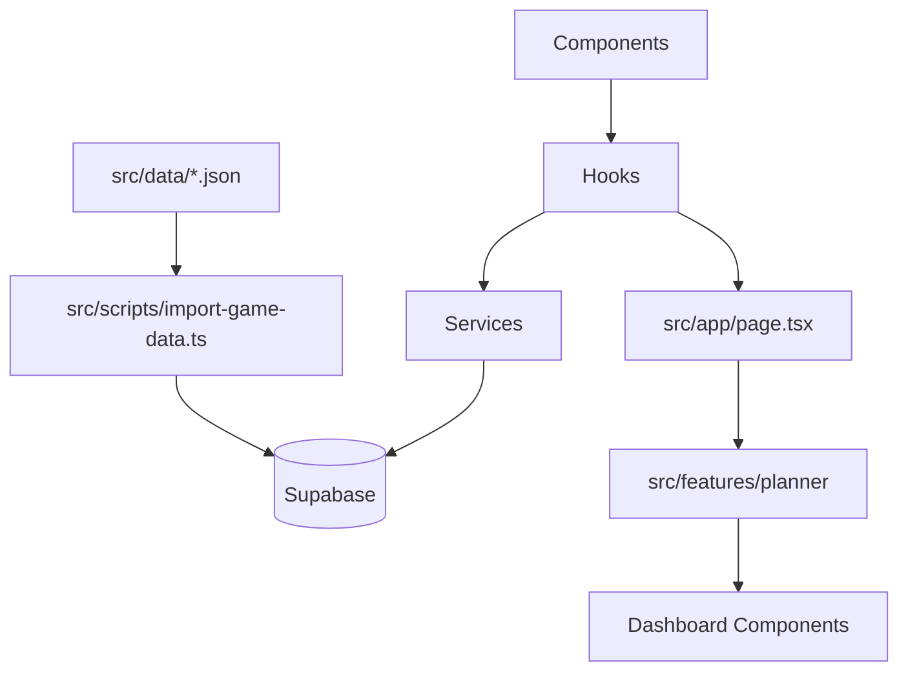
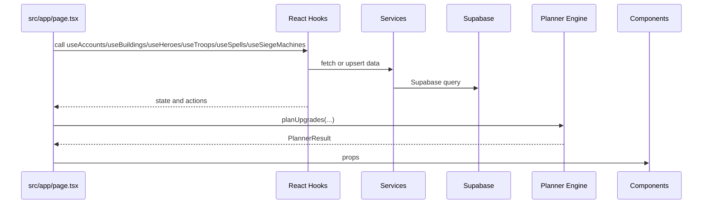

<!-- BEGIN:nextjs-agent-rules -->
# This is NOT the Next.js you know

This version has breaking changes — APIs, conventions, and file structure may all differ from your training data. Read the relevant guide in `node_modules/next/dist/docs/` before writing any code. Heed deprecation notices.
<!-- END:nextjs-agent-rules -->

# Clash Tool Agent Guide

## Table of Contents

- [Project Goal](#project-goal)
- [Tech Stack](#tech-stack)
- [Current Modules](#current-modules)
- [Architecture](#architecture)
- [Data Flow](#data-flow)
- [Important Rules](#important-rules)
- [Game Data](#game-data)
- [Supabase](#supabase)
- [Planner Engine](#planner-engine)
- [Development Workflow](#development-workflow)
- [Roadmap](#roadmap)
- [Documentation Map](#documentation-map)

## Project Goal

Clash Tool is a Next.js application for tracking Clash of Clans account progress. It currently manages accounts, buildings, heroes, laboratory items, a dashboard, game-data import files, and an upgrade planner foundation.

The long-term direction is an upgrade-planning tool that combines user account state, static game data, and deterministic planner rules.

## Tech Stack

| Area | Current choice |
| --- | --- |
| App framework | Next.js 16 App Router |
| UI | React 19, Tailwind CSS 4 |
| Data backend | Supabase |
| Language | TypeScript strict |
| Scripts | `tsx` for TypeScript scripts/tests |
| Tests | Node test runner via `tsx --test` |

## Current Modules

| Module | Status | Main files |
| --- | --- | --- |
| Accounts | Implemented | `src/hooks/useAccounts.ts`, `src/services/accountService.ts`, `src/components/accounts/` |
| Buildings | Implemented | `useBuildings`, `buildingService`, `components/buildings` |
| Dashboard | Implemented | `src/components/dashboard/` |
| Heroes | Implemented | `useHeroes`, `heroService`, `components/heroes`, `src/data/heroes.json` |
| Laboratory | Implemented | troops, spells, siege machines hooks/services/components/data |
| Game-data importer | Implemented | `src/scripts/import-game-data.ts` |
| Planner | Implemented foundation plus v1 recommendations | `src/features/planner/` |

## Architecture



Layer responsibilities:

- `src/components`: presentational UI only. No direct Supabase queries.
- `src/hooks`: React state/effects and user actions.
- `src/services`: Supabase reads/writes and row mapping.
- `src/features/planner`: framework-independent business logic.
- `src/data`: JSON source of truth for game-data samples.
- `src/scripts`: import pipeline and SQL helper files.
- `src/types`: shared TypeScript domain types.

## Data Flow

Runtime app flow:



## Important Rules

- Do not edit `.env.local` unless explicitly requested.
- Do not change database structure from app code.
- SQL helper files in `src/scripts/sql/` are not executed automatically.
- Keep TypeScript strict and avoid `any`.
- UI components must not contain business logic or direct Supabase queries.
- Hooks may contain React orchestration.
- Services own Supabase access.
- Planner must remain independent of React, Next.js, and Supabase.
- JSON files under `src/data/` are the source of truth for imported game data.
- Before changing Next.js code, read the relevant local docs in `node_modules/next/dist/docs/`.

## Game Data

Game data lives in:

- `src/data/buildings.json`
- `src/data/heroes.json`
- `src/data/troops.json`
- `src/data/spells.json`
- `src/data/siege-machines.json`
- `src/data/game-version.json`

The importer reads these files, validates their shape, maps them to Supabase rows, and uses upserts.

## Supabase

The browser app uses `src/lib/supabase.ts`. Services call `getSupabaseClient()`.

Runtime tables referenced by code:

- accounts and account progress tables
- buildings, building_levels, account_buildings
- heroes, hero_levels, account_heroes
- troops, troop_levels, account_troops
- spells, spell_levels, account_spells
- siege_machines, siege_machine_levels, account_siege_machines

Only heroes and laboratory table SQL helper files are present in `src/scripts/sql/`. No SQL helper file for accounts/buildings is currently present in the repository.

## Planner Engine

The planner module lives in `src/features/planner/`.

It currently accepts account state plus planner items, current levels, and optional upgrade level metadata. It outputs possible upgrades, recommendations, progress, aggregate costs, aggregate time, and simple priority scores.

Current planner item types:

- `building`
- `hero`
- `troop`
- `spell`
- `siege_machine`

## Development Workflow

Common commands:

```bash
npm run dev
npm run lint
npm test
npm run build
npm run import-game-data
```

Notes:

- `npm run build` may need network access because `next/font` fetches Google Fonts.
- `npm test` uses `tsx`, which may need permission to open a local IPC socket in sandboxed environments.
- `npm run import-game-data` reads `.env.local` but does not modify it.

## Roadmap

| Status | Area |
| --- | --- |
| DONE | Foundation |
| DONE | Accounts |
| DONE | Buildings |
| DONE | Dashboard |
| DONE | Heroes |
| DONE | Laboratory |
| IN PROGRESS | Intelligent Planner |
| PLANNED | Pets |
| PLANNED | Equipment |
| PLANNED | Walls |
| PLANNED | Upgrade Queue |
| PLANNED | AI Import |

## Documentation Map

Read `docs/PROJECT.md` first, then:

- `docs/ARCHITECTURE.md`
- `docs/DATABASE.md`
- `docs/GAME_DATA.md`
- `docs/PLANNER.md`
- `docs/IMPORT_PIPELINE.md`
- `docs/DEVELOPMENT.md`
- `docs/CODING_STANDARDS.md`
- `docs/TESTING.md`
- `docs/ROADMAP.md`
- `docs/CONTRIBUTING.md`
