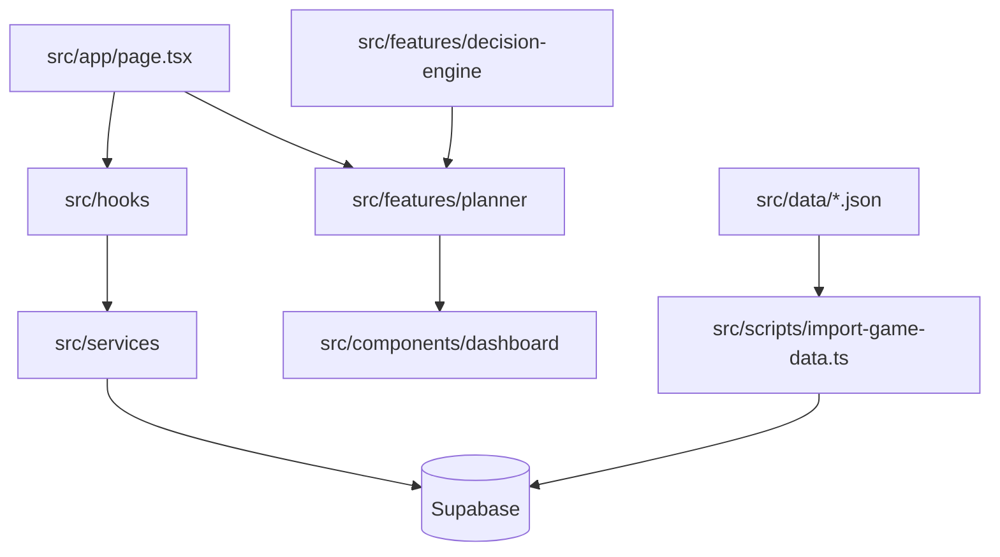

<!-- BEGIN:nextjs-agent-rules -->
# This is NOT the Next.js you know

This version has breaking changes — APIs, conventions, and file structure may all differ from your training data. Read the relevant guide in `node_modules/next/dist/docs/` before writing any code. Heed deprecation notices.
<!-- END:nextjs-agent-rules -->

# Clash Tool Agent Guide

## Table of Contents

- [Purpose](#purpose)
- [Current Stack](#current-stack)
- [Current Project State](#current-project-state)
- [Architecture](#architecture)
- [Layer Rules](#layer-rules)
- [Game Data](#game-data)
- [Supabase](#supabase)
- [Planner](#planner)
- [Decision Engine](#decision-engine)
- [Git Workflow](#git-workflow)
- [Coding Standards](#coding-standards)
- [Commands](#commands)
- [Roadmap Snapshot](#roadmap-snapshot)
- [Documentation Map](#documentation-map)

## Purpose

Clash Tool is a Next.js application for tracking Clash of Clans account progress and generating deterministic upgrade recommendations from account state plus imported game data.

The current product direction is a planner-centered tool: account data lives in Supabase, sample game data lives in JSON, React hooks load runtime state, and framework-independent planner logic calculates progress and recommendations.

## Current Stack

| Area | Current choice |
| --- | --- |
| Framework | Next.js 16 App Router |
| UI | React 19 |
| Styling | Tailwind CSS 4 |
| Runtime database | Supabase |
| Language | TypeScript strict |
| Scripts/tests | `tsx`, Node test runner |
| CI | GitHub Actions |

## Current Project State

| Area | Status | Evidence |
| --- | --- | --- |
| Foundation | Done | `src/app`, `src/components`, `src/hooks`, `src/services`, `src/types` |
| Accounts | Done | `accountService`, `useAccounts`, account components |
| Buildings | Done | `buildingService`, `useBuildings`, building components |
| Dashboard | Done | `src/components/dashboard/` |
| Heroes | Done | hero data, SQL helper, service, hook, components |
| Laboratory | Done | troops, spells, siege machines data/services/hooks/components |
| Planner V1 | Done | `src/features/planner/` |
| Decision Engine foundation | In progress | `src/features/decision-engine/` coordinates Planner and placeholder modules |
| CI/CD foundation | Done | `.github/workflows/ci.yml` |
| Planner V2 | In progress | planner accepts multiple item types; queue/simulation modules are not present on this branch |
| Upgrade Queue | In progress | planner types include queue concepts; no dedicated `src/features/upgrade-queue/` module yet |
| Builder Simulation | In progress | builder availability exists in planner types; no dedicated feature module yet |
| Progress Forecast | In progress | dashboard shows planner progress; no dedicated forecast module yet |

## Architecture



## Layer Rules

| Layer | Responsibility | Must not do |
| --- | --- | --- |
| `src/components` | Render UI from props | Query Supabase directly |
| `src/hooks` | Own React state, effects, loading/saving state, user actions | Define SQL schema |
| `src/services` | Own Supabase reads/writes and row mapping | Render JSX |
| `src/features` | Own framework-independent business logic | Import React, Next.js, or Supabase |
| `src/scripts` | Run import/maintenance workflows | Change app UI |
| `src/data` | Store importable game-data samples | Store runtime account state |

## Game Data

Current game-data source files are array-based JSON files:

| File | Domain |
| --- | --- |
| `src/data/buildings.json` | Buildings |
| `src/data/heroes.json` | Heroes |
| `src/data/troops.json` | Troops |
| `src/data/spells.json` | Spells |
| `src/data/siege-machines.json` | Siege machines |
| `src/data/game-version.json` | Dataset metadata |

Current IDs in these files are UUIDs because the importer maps directly to existing Supabase primary keys. Localized display names are stored in `name`.

Future game-data work is planned to move toward English stable IDs with localized display names, but that folder-based structure is not implemented on this branch.

## Supabase

The app uses `src/lib/supabase.ts` for browser Supabase setup. Services call `getSupabaseClient()`.

Runtime tables referenced by current code:

| Domain | Tables |
| --- | --- |
| Accounts | `accounts` |
| Buildings | `buildings`, `building_levels`, `account_buildings` |
| Heroes | `heroes`, `hero_levels`, `account_heroes` |
| Troops | `troops`, `troop_levels`, `account_troops` |
| Spells | `spells`, `spell_levels`, `account_spells` |
| Siege machines | `siege_machines`, `siege_machine_levels`, `account_siege_machines` |

SQL helper files exist for heroes and laboratory tables in `src/scripts/sql/`. They are not executed automatically.

## Planner

The planner lives in `src/features/planner/` and is framework-independent.

Current planner item types:

- `building`
- `hero`
- `troop`
- `spell`
- `siege_machine`

The planner currently returns possible upgrades, blocked upgrades, recommendations, progress, aggregate costs, aggregate time, and simple priority scores.

## Decision Engine

The Decision Engine lives in `src/features/decision-engine/` and is framework-independent. It currently:

- accepts a `DecisionContext`
- supports `PlayerGoal` values `MAX`, `FARMING`, `WAR`, `LEGENDS`, and `SMART_RUSH`
- selects an initial strategy from the player goal
- calls the Planner
- maps planner recommendations into Decision Engine recommendations with multiple reasons
- returns placeholder queue, simulation, and forecast results

## Git Workflow

| Practice | Current convention |
| --- | --- |
| Branches | Work happens on scoped branches such as `feature/<topic>`, `docs/<topic>`, or `infrastructure/<topic>` |
| Commits | No formal commit convention file is present; keep messages concise and scoped |
| Pull requests | CI should run lint, tests, and build |
| Review focus | Scope control, no `.env.local` changes, no accidental schema changes, no direct Supabase calls in components |

## Coding Standards

| Topic | Standard |
| --- | --- |
| TypeScript | Strict TypeScript; do not use `any` |
| Imports | Prefer existing aliases such as `@/` |
| Components | UI-only, props in, callbacks out |
| Hooks | React orchestration only |
| Services | Supabase access and database row mapping |
| Features | Pure business logic where possible |
| Scripts | Validate before writing to Supabase |
| Environment | Do not edit `.env.local` unless explicitly requested |
| Next.js | Read local docs under `node_modules/next/dist/docs/` before changing Next.js code |

## Commands

```bash
npm run dev
npm run lint
npm test
npm run build
npm run import-game-data
```

Notes:

- `npm test` uses `tsx`, which may require permission to open a local IPC pipe in sandboxed environments.
- `npm run build` may need network access because `next/font` fetches Google Fonts.
- `npm run import-game-data` reads `.env.local` into the Node process but does not modify it.

## Roadmap Snapshot

| Status | Areas |
| --- | --- |
| Done | Foundation, Dashboard, Heroes, Laboratory, Planner V1, CI/CD, GitHub workflow, Vercel-compatible Next.js build |
| In progress | Planner V2, Decision Engine, Upgrade Queue, Builder Simulation, Progress Forecast |
| Planned | Complete Game Data, Screenshot Import, Pets, Hero Equipment, Walls, AI Assistant |

## Documentation Map

Start with:

- `README.md`
- `docs/PROJECT.md`
- `docs/PRODUCT_VISION.md`
- `docs/ARCHITECTURE.md`
- `docs/DECISIONS.md`

Then use the focused docs:

- `docs/DATABASE.md`
- `docs/GAME_DATA.md`
- `docs/IMPORT_PIPELINE.md`
- `docs/PLANNER.md`
- `docs/DECISION_ENGINE.md`
- `docs/ROADMAP.md`
- `docs/DEVELOPMENT.md`
- `docs/CODING_STANDARDS.md`
- `docs/TESTING.md`
- `docs/CONTRIBUTING.md`
