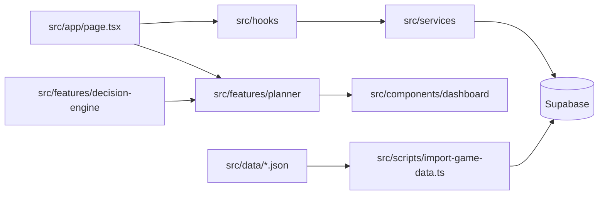

# Architecture

## Table of Contents

- [Overview](#overview)
- [Folder Structure](#folder-structure)
- [Layer Responsibilities](#layer-responsibilities)
- [Data Flow](#data-flow)
- [Components](#components)
- [Hooks](#hooks)
- [Services](#services)
- [Features](#features)
- [Scripts and Data](#scripts-and-data)

## Overview

Clash Tool uses a layered frontend architecture. Components receive props, hooks orchestrate React state, services access Supabase, and feature modules contain isolated business logic.

## Folder Structure

| Path | Responsibility |
| --- | --- |
| `src/app/` | Next.js App Router entry files |
| `src/components/` | UI components grouped by domain |
| `src/hooks/` | React hooks for loading and mutating domain state |
| `src/services/` | Supabase access and row mapping |
| `src/features/planner/` | Planner business logic |
| `src/features/decision-engine/` | Decision orchestration foundation |
| `src/data/` | JSON game-data source files |
| `src/scripts/` | Import pipeline and SQL helper files |
| `src/types/` | Shared TypeScript types |
| `src/lib/` | Shared library setup, currently Supabase |

## Layer Responsibilities

| Layer | Owns | Must not own |
| --- | --- | --- |
| Components | Markup, display states, buttons | Supabase queries |
| Hooks | React state, effects, loading states, save states, optimistic updates | SQL schemas |
| Services | Supabase queries and row mapping | JSX |
| Planner | Upgrade candidate business logic | React, Next.js, Supabase |
| Decision Engine | Recommendation orchestration across planner and future modules | React, Next.js, Supabase |
| Scripts | Import validation and upsert flow | App UI |

## Data Flow

Runtime app:

1. `src/app/page.tsx` calls hooks.
2. Hooks call services.
3. Services query Supabase.
4. Hooks return data and actions.
5. `page.tsx` converts loaded domain data into planner input.
6. `page.tsx` calls `planUpgrades`.
7. Dashboard components render `PlannerResult`.

## Components

Component groups currently present:

- `components/accounts`
- `components/buildings`
- `components/dashboard`
- `components/heroes`
- `components/laboratory`
- `components/ui`

The components follow the existing dark theme, rounded cards, and amber accents.

## Hooks

Domain hooks currently present:

- `useAccounts`
- `useBuildings`
- `useHeroes`
- `useTroops`
- `useSpells`
- `useSiegeMachines`

These hooks expose loaded rows, filtered available rows, progress, loading state, saving state, and update handlers.

## Services

Services currently present:

- `accountService`
- `buildingService`
- `heroService`
- `troopService`
- `spellService`
- `siegeMachineService`

All runtime Supabase table access belongs here. Import scripts are the exception for data-import workflows.

## Features

`src/features/planner` contains:

- types
- constants
- rules
- utils
- engine
- service boundary
- tests
- README

`src/features/decision-engine` contains the first orchestration layer. It currently calls the Planner, maps planner recommendations into Decision Engine recommendations, selects a strategy from `PlayerGoal`, and returns placeholders for queue, builder simulation, and progress forecast.

Dedicated modules for upgrade queue, builder simulation, and progress forecast are not present on this branch.

## Scripts and Data

The importer is `src/scripts/import-game-data.ts`. It reads JSON files from `src/data/`, validates them, and writes to Supabase with upserts.
