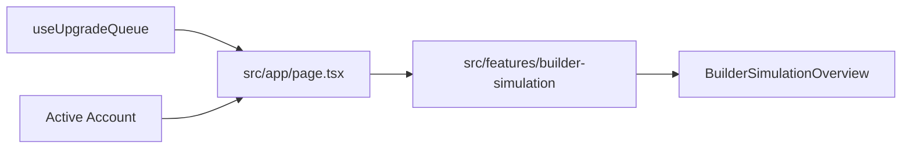

# Builder Simulation

## Table of Contents

- [Purpose](#purpose)
- [V1 Logic](#v1-logic)
- [Data Flow](#data-flow)
- [Result](#result)
- [Limits](#limits)
- [Future Extensions](#future-extensions)

## Purpose

Builder Simulation V1 calculates a live forecast for the existing Upgrade Queue. It does not persist simulation output to Supabase.

## V1 Logic

- Input is the current `UpgradeQueueItem[]`.
- `builderCount` comes from the active account.
- Queue items are sorted by `queueOrder`.
- The next upgrade is assigned to the builder with the earliest free hour.
- All times are relative hours from start `0`.

## Data Flow

## Result

The simulation result includes:

- assignments
- total duration in hours
- total duration in days
- builder count
- idle time in hours

Each assignment includes:

- builder index
- queue item id
- name
- item type
- from level
- to level
- start hour
- end hour
- duration hours

## Limits

V1 intentionally excludes:

- resource logic
- calendar dates
- magic items
- pauses
- priority recalculation
- persistence of simulation results

## Future Extensions

Natural next steps:

- calendar-aware scheduling
- builder availability from active upgrades
- resource-aware queue pauses
- magic item handling
- strategy-specific queue optimization
