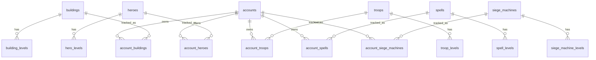

# Database

## Table of Contents

- [Scope](#scope)
- [Runtime Tables Referenced by Code](#runtime-tables-referenced-by-code)
- [SQL Files Present in Repository](#sql-files-present-in-repository)
- [Relationships](#relationships)
- [Account Data](#account-data)
- [Game Data](#game-data)

## Scope

This document describes database tables referenced by the current code and SQL helper files present in the repository. It does not claim that every referenced table already exists in Supabase.

## Runtime Tables Referenced by Code

| Table | Purpose | Referenced in |
| --- | --- | --- |
| `accounts` | User-created Clash accounts | `accountService` |
| `buildings` | Building game data | `buildingService`, importer |
| `building_levels` | Building level game data | `buildingService`, importer |
| `account_buildings` | Per-account building levels | `buildingService` |
| `heroes` | Hero game data | `heroService`, importer |
| `hero_levels` | Hero level game data | `heroService`, importer |
| `account_heroes` | Per-account hero levels | `heroService` |
| `troops` | Troop game data | `troopService`, importer |
| `troop_levels` | Troop level game data | `troopService`, importer |
| `account_troops` | Per-account troop levels | `troopService` |
| `spells` | Spell game data | `spellService`, importer |
| `spell_levels` | Spell level game data | `spellService`, importer |
| `account_spells` | Per-account spell levels | `spellService` |
| `siege_machines` | Siege machine game data | `siegeMachineService`, importer |
| `siege_machine_levels` | Siege machine level game data | `siegeMachineService`, importer |
| `account_siege_machines` | Per-account siege machine levels | `siegeMachineService` |
| `magic_item_catalog` | Stable Magic-Item IDs and planner effects | `magicItemService`, screenshot import |
| `account_magic_items` | Per-account quantities and queue reservations | `magicItemService`, screenshot import |
| `account_upgrade_preferences` | Per-account preferred, avoided or excluded Decision Engine candidates | `decisionPreferenceService` |
| `account_health_snapshots` | Daily Account Health, strategy fit, balance and rush-risk history | `accountHealthService` |
| `account_insight_settings` | Disabled Planner Intelligence categories per account | `plannerInsightService` |
| `account_insight_actions` | Stable dismiss and snooze state for individual insights | `plannerInsightService` |

## SQL Files Present in Repository

| File | Creates |
| --- | --- |
| `src/scripts/sql/heroes.sql` | `heroes`, `hero_levels`, `account_heroes` |
| `src/scripts/sql/troops.sql` | `troops`, `troop_levels`, `account_troops` |
| `src/scripts/sql/spells.sql` | `spells`, `spell_levels`, `account_spells` |
| `src/scripts/sql/siege-machines.sql` | `siege_machines`, `siege_machine_levels`, `account_siege_machines` |
| `src/scripts/sql/screenshot-import.sql` | Screenshot sessions, files, detections, proposed changes, events and feedback |
| `src/scripts/sql/screenshot-progress-catalog.sql` | Screenshot catalog, account progress, wall distributions, upgrade slots, resource snapshots and analysis jobs |
| `src/scripts/sql/screenshot-resource-capacities.sql` | Adds separately persisted resource storage capacities to existing screenshot snapshots |
| `src/scripts/sql/screenshot-full-account-import.sql` | Allows one guided screenshot session to combine all supported account areas |
| `src/scripts/sql/screenshot-profile-details.sql` | Adds confirmed experience-level and clan-name fields to accounts |
| `src/scripts/sql/screenshot-file-metadata.sql` | Adds privacy-minimized source/normalized file metadata and coarse device platform |
| `src/scripts/sql/screenshot-language-detection.sql` | Stores detected German/English screenshot language and confidence independently from app language |
| `src/scripts/sql/screenshot-analysis-job-idempotency.sql` | Allows only one queued/running analysis stage per screenshot and job type |
| `src/scripts/sql/screenshot-import-audit-triggers.sql` | RLS-preserving lifecycle audit triggers for sessions, uploads and original deletion |
| `src/scripts/sql/decision-engine-preferences.sql` | RLS-protected manual Decision Engine priorities and exclusions |
| `src/scripts/sql/account-health-snapshots.sql` | RLS-protected daily Account Health history |
| `src/scripts/sql/planner-insight-preferences.sql` | RLS-protected Planner Intelligence category and action controls |

No SQL helper file for `accounts`, `buildings`, `building_levels`, or `account_buildings` is currently present in the repository.

## Relationships

## Account Data

Account services read and write:

- account name
- town hall level
- builder count
- optional screenshot-confirmed experience level
- clan status (`unknown`, `none`, or `member`) and optional clan name
- created timestamp

Progress tables store `current_level` per `account_id` and game-data id.

Screenshot resource snapshots store current resource amounts and their optional
storage capacities separately. Row-level ownership continues to be derived from
the linked account; a confirmed import session is retained as the source.

## Game Data

Game-data tables store:

- id
- name
- category
- unlock town hall level
- max level
- sort order

Level tables store:

- level
- town hall level
- upgrade time in hours
- gold cost
- elixir cost
- dark elixir cost
- hitpoints
