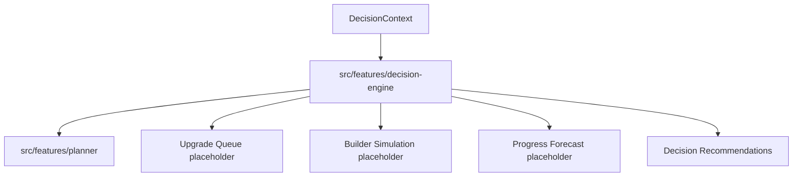

# Decision Engine

## Table of Contents

- [Purpose](#purpose)
- [Architecture](#architecture)
- [Data Flow](#data-flow)
- [Modules](#modules)
- [Player Goals](#player-goals)
- [Current Implementation](#current-implementation)
- [Extensibility](#extensibility)
- [Example Flow](#example-flow)

## Purpose

The Decision Engine is the planned orchestration layer for Clash Tool recommendations. The Planner remains a core module, but it should eventually become one input among several decision modules.

## Architecture



The Decision Engine contains no React, Next.js, or Supabase dependencies. It coordinates plain data and returns a `DecisionResult`.

## Data Flow

1. A caller creates a `DecisionContext`.
2. The context includes `playerGoal` and `plannerInput`.
3. The Decision Engine selects a strategy from the player goal.
4. The Decision Engine calls the existing Planner.
5. Planner recommendations are mapped into Decision Engine recommendations.
6. Placeholder queue, simulation, and forecast results are returned for future modules.

## Modules

| Module | Current status | Responsibility |
| --- | --- | --- |
| Planner | Integrated | Produces upgrade candidates and planner recommendations |
| Upgrade Queue | Placeholder | Will create ordered upgrade queues |
| Builder Simulation | Placeholder | Will assign upgrades to builders over time |
| Progress Forecast | Placeholder | Will project future progress |
| Recommendation Engine | Placeholder concept | Will combine module outputs into user-facing recommendations |
| Strategy Engine | Initial strategy selection | Maps `PlayerGoal` to a strategy |
| Resource Engine | Placeholder concept | Will reason about resources and overflow |

## Player Goals

Supported goals:

| Goal | Intent |
| --- | --- |
| `MAX` | Maximize overall account progress |
| `FARMING` | Improve farming and resource efficiency |
| `WAR` | Prioritize war-relevant strength |
| `LEGENDS` | Prioritize legends performance |
| `SMART_RUSH` | Support controlled rushing |

## Current Implementation

Current files:

| File | Purpose |
| --- | --- |
| `decision-engine.types.ts` | Decision Engine contracts |
| `decision-engine.utils.ts` | Strategy selection and recommendation mapping |
| `decision-engine.ts` | Core orchestration |
| `decision-engine.service.ts` | Service boundary |
| `decision-engine.test.ts` | Unit tests |
| `README.md` | Feature-local documentation |

The first engine implementation:

- calls the existing Planner
- reuses the Planner result
- creates a Recommendation list
- returns placeholder results for queue, simulation, and forecast
- allows `PlayerGoal` to influence strategy selection

## Extensibility

Future modules can be added behind the same `DecisionResult` shape:

- queue creation can consume planner recommendations
- builder simulation can consume queue results
- forecast can consume simulation results
- resource logic can add recommendation reasons
- strategy logic can reorder or filter recommendations

## Example Flow

```ts
runDecisionEngine({
  playerGoal: "WAR",
  plannerInput,
});
```

The result includes:

- selected strategy
- planner result
- placeholder queue result
- placeholder simulation result
- placeholder forecast result
- decision recommendations with multiple reasons
