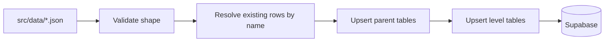

# Game Data

## Table of Contents

- [Source of Truth](#source-of-truth)
- [Current Files](#current-files)
- [Current Schema](#current-schema)
- [Validation](#validation)
- [Import Process](#import-process)
- [ID and Naming Conventions](#id-and-naming-conventions)
- [Planned Structure](#planned-structure)
- [Versioning](#versioning)

## Source of Truth

The current source of truth for importable sample game data is JSON under `src/data/`.

The repository does not contain complete Clash of Clans game data. Current files are small sample datasets used by the import pipeline and app modules.

## Current Files

| File | Domain |
| --- | --- |
| `src/data/buildings.json` | Buildings |
| `src/data/traps.json` | Home Village traps, levels and per-Town-Hall instance counts |
| `src/data/heroes.json` | Heroes |
| `src/data/troops.json` | Troops |
| `src/data/spells.json` | Spells |
| `src/data/siege-machines.json` | Siege machines |
| `src/data/game-version.json` | Dataset metadata |

## Current Schema

Current domain files contain arrays of items:

```json
{
  "id": "11111111-1111-4111-8111-111111111111",
  "name": "Rathaus",
  "category": "Hauptgebäude",
  "unlockTownHall": 1,
  "sortOrder": 10,
  "levels": [
    {
      "level": 1,
      "townHall": 1,
      "upgradeTimeHours": 0,
      "goldCost": 0,
      "elixirCost": 0,
      "darkElixirCost": 0,
      "hitpoints": 450
    }
  ]
}
```

## Validation

`src/scripts/import-game-data.ts` validates:

- each item is an object
- `id` is a UUID
- `name` and `category` are non-empty strings
- `unlockTownHall` and `sortOrder` are positive integers
- `levels` is a non-empty array
- duplicate level numbers are rejected
- level, town hall, costs, upgrade time, and hitpoints are valid integers
- costs, upgrade time, and hitpoints are not negative
- optional availability rows contain unique Town Hall levels and valid instance counts

## Import Process



The importer:

1. Loads `.env.local` values into the Node process.
2. Reads the current hard-coded JSON files.
3. Validates item, level and optional availability structure.
4. Resolves existing rows by name where implemented.
5. Upserts parent rows.
6. Upserts level rows.
7. Upserts Town-Hall-specific building counts when present (currently traps).
8. Logs and skips optional missing laboratory tables with SQL helper pointers.

## ID and Naming Conventions

Current JSON IDs are UUIDs because they map directly to current Supabase table primary keys.

Display names are localized in `name`, for example German building and hero names. Future stable technical IDs should be English, while display names can remain localized.

## Planned Structure

A folder-per-domain structure is planned but not implemented on this branch:

```text
src/data/
  game-version.json
  buildings/
  heroes/
  troops/
  spells/
  siege-machines/
  pets/
  equipment/
  walls/
```

In that future structure, each item can live in its own JSON file with an English stable ID such as `town_hall`, `inferno_tower`, or `archer_queen`.

## Versioning

`src/data/game-version.json` stores dataset metadata:

- game name
- data version
- schema version
- description
