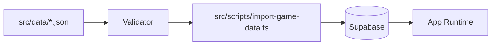

# Import Pipeline

## Table of Contents

- [Overview](#overview)
- [Flow](#flow)
- [Validation](#validation)
- [Upserts](#upserts)
- [Missing Tables](#missing-tables)
- [Command](#command)

## Overview

The import pipeline converts JSON game-data files into Supabase rows.



## Flow

1. Load `.env.local` into the Node process.
2. Create Supabase client.
3. Read JSON files.
4. Validate data shape.
5. Resolve existing IDs by name.
6. Upsert parent rows.
7. Upsert level rows.

## Validation

The importer validates:

- item is an object
- id is a UUID
- name and category are non-empty strings
- unlock town hall and sort order are positive integers
- levels are present
- duplicate level numbers are rejected
- costs, time, and hitpoints are non-negative integers

## Upserts

Parent rows use `onConflict: "id"`. Level rows use compound keys such as:

- `building_id,level`
- `hero_id,level`
- `troop_id,level`
- `spell_id,level`
- `siege_machine_id,level`

## Missing Tables

For laboratory tables, missing tables are logged and skipped with a pointer to SQL helper files.

## Command

```bash
npm run import-game-data
```
