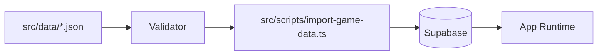

# Import Pipeline

## Table of Contents

- [Overview](#overview)
- [Flow](#flow)
- [Validation](#validation)
- [Upserts](#upserts)
- [Missing Tables](#missing-tables)
- [Command](#command)
- [Current Limits](#current-limits)

## Overview

The import pipeline converts current JSON game-data sample files into Supabase rows.



## Flow

1. Load `.env.local` into the Node process without modifying it.
2. Create a Supabase client for the script.
3. Read the current JSON files:
   - `src/data/buildings.json`
   - `src/data/heroes.json`
   - `src/data/troops.json`
   - `src/data/spells.json`
   - `src/data/siege-machines.json`
4. Validate item and level shape.
5. Resolve existing IDs by name where implemented.
6. Upsert parent rows.
7. Upsert level rows.

## Validation

The importer validates:

- item is an object
- `id` is a UUID
- `name` and `category` are non-empty strings
- `unlockTownHall` and `sortOrder` are positive integers
- `levels` is a non-empty array
- duplicate level numbers are rejected
- costs, time, and hitpoints are non-negative integers

## Upserts

Parent rows use `onConflict: "id"`. Level rows use compound keys such as:

- `building_id,level`
- `hero_id,level`
- `troop_id,level`
- `spell_id,level`
- `siege_machine_id,level`

## Missing Tables

For optional hero and laboratory tables, missing tables are logged and skipped with a pointer to SQL helper files.

## Command

```bash
npm run import-game-data
```

Der Import benötigt zusätzlich zu `NEXT_PUBLIC_SUPABASE_URL` einen
serverseitigen `SUPABASE_SECRET_KEY` (alternativ den älteren
`SUPABASE_SERVICE_ROLE_KEY`). Dieser Schlüssel darf niemals mit
`NEXT_PUBLIC_` beginnen oder in Browser-Code verwendet werden. Die App selbst
verwendet weiterhin ausschließlich den öffentlichen Schlüssel und besitzt nur
Leserechte auf den Game-Data-Tabellen.

## Current Limits

The importer currently reads hard-coded JSON file paths. Folder discovery and one-file-per-item game-data imports are planned, but not implemented on this branch.
