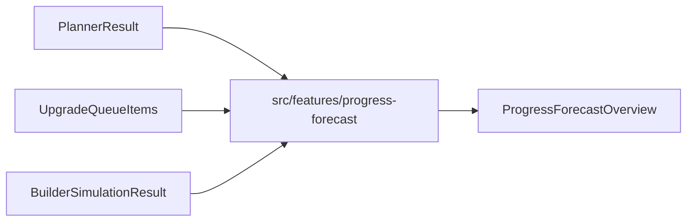

# Progress Forecast

## Table of Contents

- [Purpose](#purpose)
- [V1 Logic](#v1-logic)
- [Data Flow](#data-flow)
- [Result](#result)
- [Limits](#limits)
- [Future Extensions](#future-extensions)

## Purpose

Progress Forecast V1 provides a live projection based on current Planner progress, persisted Upgrade Queue items, and the Builder Simulation result.

The forecast is not persisted in Supabase.

## V1 Logic

- One queue item from level `X` to `X + 1` counts as one completed level.
- Queue items with larger level jumps count by `toLevel - fromLevel`.
- Progress gain is calculated from completed queue levels relative to remaining levels.
- Projected progress is clamped between `0` and `100`.
- Estimated completion hours come from Builder Simulation `totalDurationHours`.
- Estimated completion days are calculated as `hours / 24`.
- Missing input data falls back to `0`.

## Data Flow

## Result

The forecast result includes:

- `currentProgressPercent`
- `projectedProgressPercent`
- `progressGainPercent`
- `remainingLevelsBefore`
- `remainingLevelsAfter`
- `completedQueueLevels`
- `estimatedCompletionHours`
- `estimatedCompletionDays`

## Limits

V1 intentionally avoids:

- perfect progression math
- resource logic
- real calendar dates
- magic items
- queue optimization
- Supabase persistence

## Future Extensions

Natural next steps:

- use full game-data totals per domain
- account for skipped or completed queue statuses
- connect to resource forecasts
- add calendar dates when builder availability exists
- expose forecast to the Decision Engine
